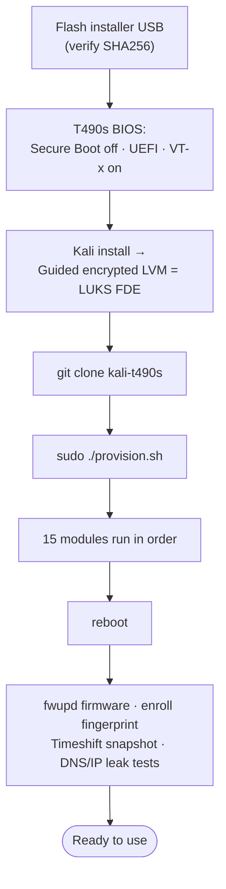
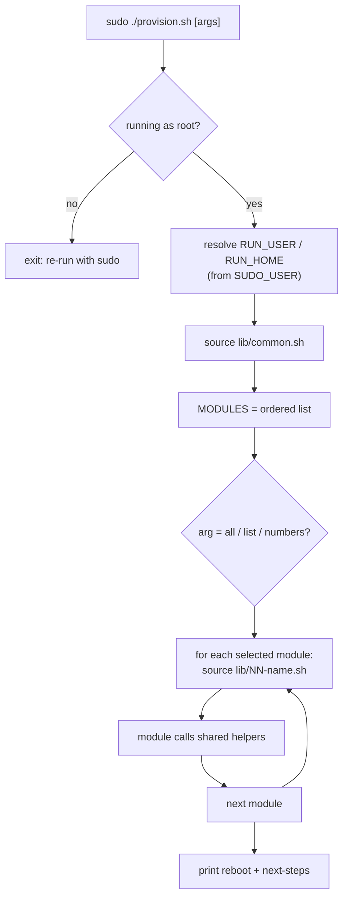
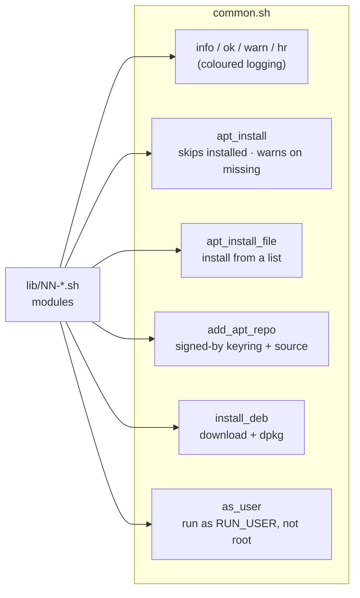

# Architecture — how the provisioning works

Visual documentation of the scripting process. These diagrams render on GitHub.
For a standalone interactive view, see the published visual (link in the repo
README / shared separately).

---

## 1. End-to-end: bare metal → ready

---

## 2. Execution model — what `provision.sh` does

The orchestrator is small; the reusable machinery lives in `common.sh`, and
each module is *sourced* (not executed) so they all share helpers + environment.

---

## 3. The shared helpers (`common.sh`)

Every module leans on these, which is why each module file stays short.

- **`as_user`** is why oh-my-zsh, VSCodium extensions, nvm, uv, bun, Rust, and
  the OSINT `go install` tools land in *your* home owned by *you*, not root.
- **`apt_install`** makes the whole run idempotent and best-effort: a missing or
  renamed package warns and the run continues.

---

## 4. The module pipeline

```mermaid
flowchart TD
    START([Fresh Kali + LUKS]) --> BASE

    subgraph FND["Foundation"]
      BASE["00-base<br/>full-upgrade · core CLI · kali metapkgs"]
    end

    subgraph DEV["Development"]
      D1["10-dev<br/>zsh · VSCodium · Docker · Go · Node · Rust · gh"]
      D2["12-dev-extras<br/>uv · pnpm/bun · lazygit · DB/API · shell QoL"]
      D3["15-vmlab<br/>KVM/virt-manager · whonix-import"]
    end

    subgraph SEC["Security · Privacy · Offense"]
      S1["20-browsers-comms<br/>Brave · Signal · Element · WireGuard"]
      S2["25-anonymity<br/>Tor · dnscrypt · Mullvad · anti-forensics"]
      S3["30-osint<br/>amass · PD suite · spiderfoot"]
      S4["35-offensive<br/>seclists · netexec · bloodhound · ghidra · msf"]
    end

    subgraph SYS["System · Hardware · Hardening"]
      Y1["40-productivity<br/>Obsidian · KeePassXC · media"]
      Y2["50-hardening<br/>ufw · MAC rand · sysctl"]
      Y3["52-hwtoken<br/>YubiKey / FIDO2"]
      Y4["60-thinkpad<br/>TLP · fwupd · fingerprint · i915"]
      Y5["70-resilience<br/>Timeshift · restic"]
    end

    subgraph FIN["Extras · Config"]
      F1["80-extras<br/>Nerd Font · Flatpak · Syncthing"]
      F2["82-qol<br/>yazi · kitty · rofi · themes"]
      F3["90-dotfiles<br/>zsh · tmux · git · starship · editor"]
    end

    BASE --> D1 --> D2 --> D3 --> S1 --> S2 --> S3 --> S4
    S4 --> Y1 --> Y2 --> Y3 --> Y4 --> Y5 --> F1 --> F2 --> F3
    F3 --> READY([Reboot → ready])
```

---

## 5. Where things end up

| Layer | Produced by | Location on the box |
|---|---|---|
| System packages | `apt_install` in modules | apt / `/usr` |
| Third-party apps | `add_apt_repo` + `install_deb` | vendor apt repos / dpkg |
| User tools (uv, bun, go tools, extensions) | `as_user` | `~/.local`, `~/go/bin`, `~/.bun`, `~/.cargo` |
| Dotfiles | `90-dotfiles` | `~/.zshrc`, `~/.config/*` (backs up existing) |
| Helper commands | heredocs in modules | `/usr/local/bin/*` (`vpn-killswitch`, `wipe-traces`, `whonix-import`, `snap-before-upgrade`, `backup-home`) |
| System config | modules 25/50/60/70 | `/etc/sysctl.d`, `/etc/NetworkManager/conf.d`, `/etc/tlp.d`, `/etc/systemd/*` |
